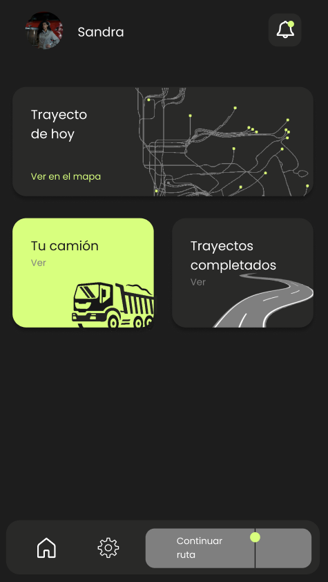
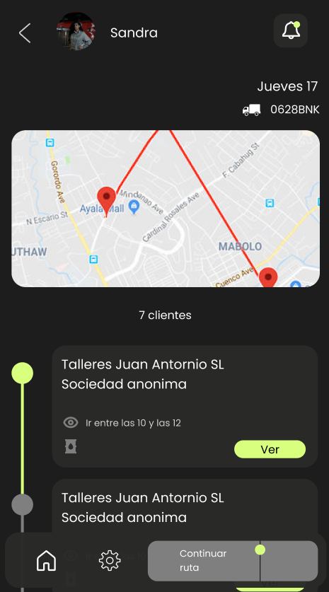
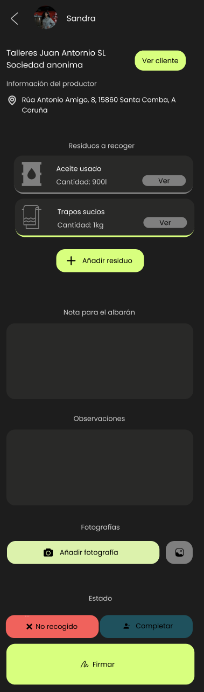
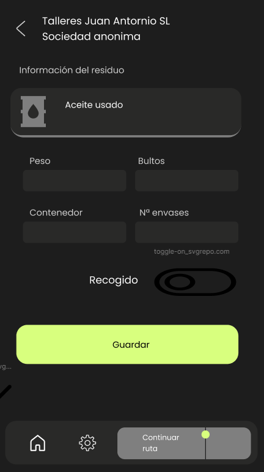

# Diseño

## Navegación

Se usará tanto navegación lineal como no lineal, ejemplos:
- Lineal
  - Home->Ruta->Info del cliente->Info del residuo
- No lineal
  - ... -> Info del residuo -> Home

### Mockups
Para diseñar las distintas pantallas de la aplicación se ha usado Figma. Indicar que faltan algunas vistas ya que no se hizo un maquetado previo para ellas. 

A continuación se muestran las distintas pantallas:
#### Home

#### Ruta

#### Información de destino

#### Residuo
